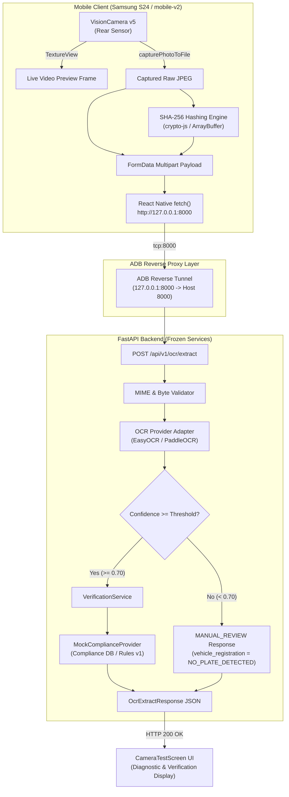
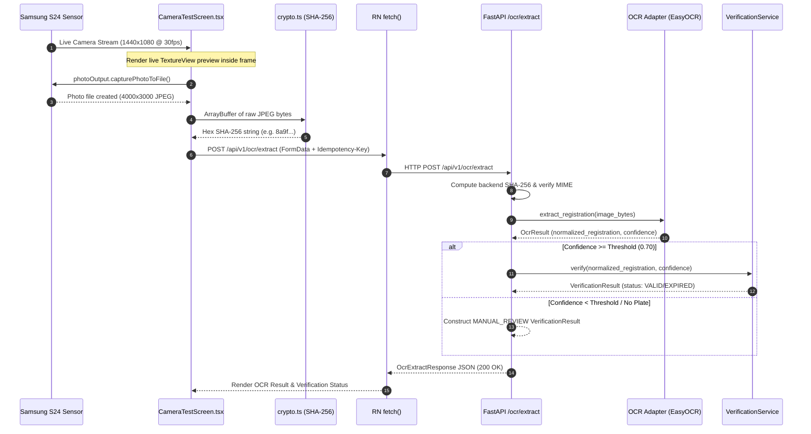

# CNG Compliance Enterprise - System Architecture

## Executive Overview
CNG Compliance Enterprise is an edge-to-cloud automated compliance verification system designed for Compressed Natural Gas (CNG) fuel stations. The system captures vehicle registration plates live at the pump via physical Android hardware (Samsung Galaxy S24), extracts registration text using an Optical Character Recognition (OCR) pipeline, and validates compliance against station records in real time.



---

## 1. System Component Topography

### 1.1 Mobile Client Layer (`mobile-v2`)
- **Framework**: React Native 0.81.6 (Legacy Architecture / Hermes JS Engine)
- **Application ID**: `com.cngcompliancemobilev2`
- **Target Device**: Samsung Galaxy S24 (`RZCY90J98FV`, Android 16 API 36, `arm64-v8a`)
- **Native Camera Engine**: `react-native-vision-camera` v5.2.3
  - **Preview Implementation**: TextureView (`implementationMode="compatible"`)
  - **Output Configuration**: Dual output stream `outputs={[previewOutput, photoOutput]}`
  - **Native C++ Bridge**: Nitro Modules (`react-native-nitro-modules` v0.37.1)
- **Crypto Engine**: SHA-256 calculation over raw binary `ArrayBuffer` (`src/utils/crypto.ts`)

### 1.2 Communication & Network Layer
- **Transport**: Cleartext HTTP over TCP loopback (`http://127.0.0.1:8000`)
- **Security Policy**: Configured via `android/app/src/main/res/xml/network_security_config.xml` permitting cleartext traffic to `127.0.0.1` and `localhost`.
- **Port Mapping**:
  - `adb reverse tcp:8081 tcp:8081` (Metro Dev Server)
  - `adb reverse tcp:8000 tcp:8000` (FastAPI Service)

### 1.3 Backend Service Layer (`backend`)
- **Framework**: FastAPI (Python 3.12, Uvicorn worker bound to `0.0.0.0:8000`)
- **OCR Adapters**: `PaddleOcrAdapter` / `EasyOCR` fallback with `mock_mode=False`
- **Domain Services**: `VerificationService` with `MockComplianceProvider`
- **Idempotency**: Handled via `Idempotency-Key` HTTP request header

---

## 2. End-to-End Data Flow Sequence



---

## 3. Data Contracts & Type Schema Alignment

### 3.1 Backend FastAPI Response Schema (`OcrExtractResponse`)
```json
{
  "raw_text": "DLOIAB1234",
  "normalized_registration": "DL01AB1234",
  "confidence": 0.7076,
  "engine_name": "EasyOCR",
  "manual_review_required": true,
  "verification_result": {
    "id": "a46cc9db-f22d-4adc-a418-3e908d7338dd",
    "vehicle_registration": "DL01AB1234",
    "status": "MANUAL_REVIEW",
    "compliance_id": null,
    "expires_at": null,
    "source_reference": null,
    "rule_version": "v1",
    "manual_review_required": true
  }
}
```

### 3.2 Mobile TypeScript Type Schema (`src/screens/CameraTestScreen.tsx`)
```typescript
export interface VerificationResult {
  id: string;
  vehicle_registration: string;
  status: 'VALID' | 'EXPIRING_SOON' | 'EXPIRED' | 'INVALID' | 'NOT_FOUND' | 'MANUAL_REVIEW' | 'PROVIDER_UNAVAILABLE';
  compliance_id?: string | null;
  expires_at?: string | null;
  source_reference?: string | null;
  rule_version: string;
  manual_review_required: boolean;
}

export interface OcrExtractResponse {
  raw_text: string;
  normalized_registration: string;
  confidence: number;
  engine_name: string;
  manual_review_required: boolean;
  verification_result?: VerificationResult | null;
}
```

---

## 4. Key Architectural Decisions & Safeguards

> [!IMPORTANT]
> **1. Frozen Backend Rule**: The FastAPI backend routes, domain models, database schemas, and verification logic remain strictly frozen. All integrations adapt client-side.

> [!TIP]
> **2. VisionCamera v5 Compatibility**: `implementationMode="compatible"` uses Android `TextureView` under the hood. This guarantees that UI elements (scan target frame overlay, status badges, diagnostic panels) properly composite over the live hardware video feed on Samsung devices.

> [!NOTE]
> **3. Single-Architecture Build Optimization**: By configuring `reactNativeArchitectures=arm64-v8a` in `android/gradle.properties` and `ndk { abiFilters "arm64-v8a" }` in `android/app/build.gradle`, native C++ CMake compilation builds strictly for the S24 ARM64 target. This eliminates multi-target Ninja build conflicts on Windows.

> [!CAUTION]
> **4. Standalone JS Asset Bundling**: Packaging `index.android.bundle` into `android/app/src/main/assets/index.android.bundle` ensures the application runs autonomously on physical Android hardware without requiring an active Metro WebSocket connection.

---

## 5. Execution & Deployment Quick Reference

### 5.1 Build & Package Mobile v2
```powershell
# 1. Navigate to mobile-v2
cd C:\Claude_projects\CNG_Compliance_Enterprise\mobile-v2

# 2. Check TypeScript types
npm run typecheck

# 3. Package offline JS bundle into assets
New-Item -ItemType Directory -Force -Path android\app\src\main\assets
npx react-native bundle --platform android --dev false --entry-file index.js --bundle-output android/app/src/main/assets/index.android.bundle --assets-dest android/app/src/main/res

# 4. Assemble Debug APK
cd android
.\gradlew assembleDebug
```

### 5.2 Deploy & Run on Samsung S24 (`RZCY90J98FV`)
```powershell
$ADB = "C:\Users\Tanish\AppData\Local\Android\Sdk\platform-tools\adb.exe"

# Re-establish ADB Reverse Port Forwarding
&$ADB -s RZCY90J98FV reverse tcp:8081 tcp:8081
&$ADB -s RZCY90J98FV reverse tcp:8000 tcp:8000

# Install APK & Grant Camera Permissions
&$ADB -s RZCY90J98FV install -r C:\Claude_projects\CNG_Compliance_Enterprise\mobile-v2\android\app\build\outputs\apk\debug\app-debug.apk
&$ADB -s RZCY90J98FV shell pm grant com.cngcompliancemobilev2 android.permission.CAMERA

# Launch Application
&$ADB -s RZCY90J98FV shell am force-stop com.cngcompliancemobilev2
&$ADB -s RZCY90J98FV shell am start -n com.cngcompliancemobilev2/.MainActivity
```
